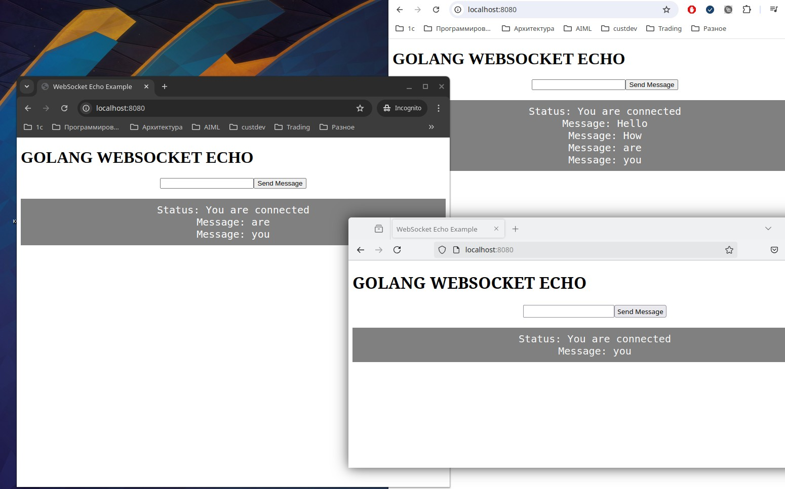

# Простой Websocket-echo сервер

**Пояснение к работе программы** 
* После запуска сервера, следует подключиться(браузером) к "http://localhost:8080/"
* Хендлер rootHandler связан с корневым маршрутом "/" и обслуживанием файла "index.html". Скрипт из "index.html" вызывает хендлер echoHandler(связан с маршрутом "/echo"), создает websocket-клиент и соединение с сервером. 
* После установки соединения, срабатывает обработчик "socket.onopen", выводящий сообщение о подключении. 
* При нажатии кнопки "Send Message" срабатывает функция send(), которая отправляет содержимое текстового поля input на сервер.
* Когда сервер отправляет сообщение обратно (все подключенные клиенты получают это сообщение, включая отправителя), срабатывает обработчик "socket.onmessage", который добавляет новое сообщение в элемент "output".

